## A Neural Network From Scratch With Python


### Prerequisites
You must have Numpy (for math computations)

### Project Structure
Install [numpy](http://www.numpy.org/), the only dependency, if you need to:

```bash
$ pip install numpy
```

Then, run it with no arguments:

```bash
$ python network.py
```

### Machine Learning for Beginners: An Introduction to Neural Networks
A simple explanation of how they work and how to implement one from scratch in Python

Here’s something that may surprise you: neural networks aren’t that complicated! The term “neural network” gets used as a buzzword a lot, but in reality they’re often much simpler than people imagine. This project is intended for complete beginners and assumes ZERO prior knowledge of machine learning. We’ll understand how neural networks work while implementing one from scratch in Python.


1. Building Blocks: Neurons
First, we have to talk about neurons, the basic unit of a neural network. A neuron takes inputs, does some math with them, and produces one output. Here’s what a 2-input neuron looks like:

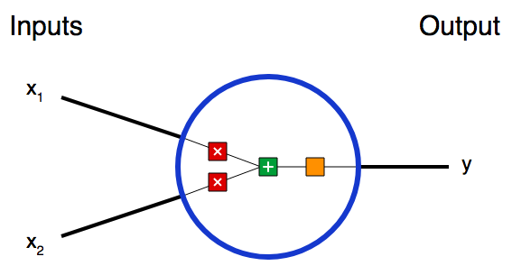

3 things are happening here:

> First, each input is multiplied by a weight: 

> Next, all the weighted inputs are added together with a bias bb. 

> Finally, the sum is passed through an activation function.

The activation function is used to turn an unbounded input into an output that has a nice, predictable form. A commonly used activation function is the sigmoid function:

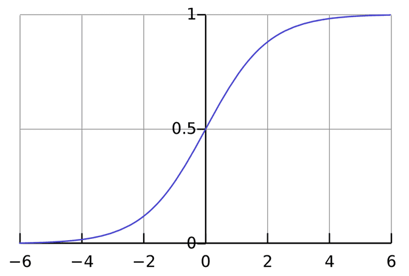

The sigmoid function only outputs numbers in the range (0, 1)(0,1). You can think of it as compressing (-\infty, +\infty)(−∞,+∞) to (0, 1)(0,1) - big negative numbers become ~0, and big positive numbers become ~1.


### Coding a Neuron
Time to implement a neuron! We’ll use NumPy, a popular and powerful computing library for Python, to help us do math:

import numpy as np

```
def sigmoid(x):
  # Our activation function: f(x) = 1 / (1 + e^(-x))
  return 1 / (1 + np.exp(-x))

class Neuron:
  def __init__(self, weights, bias):
    self.weights = weights
    self.bias = bias

  def feedforward(self, inputs):
    # Weight inputs, add bias, then use the activation function
    total = np.dot(self.weights, inputs) + self.bias
    return sigmoid(total)

weights = np.array([0, 1]) # w1 = 0, w2 = 1
bias = 4                   # b = 4
n = Neuron(weights, bias)

x = np.array([2, 3])       # x1 = 2, x2 = 3
print(n.feedforward(x))    # 0.9990889488055994
```

2. Combining Neurons into a Neural Network
A neural network is nothing more than a bunch of neurons connected together. Here’s what a simple neural network might look like:

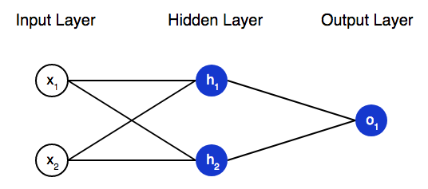

This network has 2 inputs, a hidden layer with 2 neurons and an output layer with 1 neuron. Notice that the inputs are the outputs - that’s what makes this a network.

> A hidden layer is any layer between the input (first) layer and output (last) layer. There can be multiple hidden layers!

A neural network can have any number of layers with any number of neurons in those layers. The basic idea stays the same: feed the input(s) forward through the neurons in the network to get the output(s) at the end. For simplicity, we’ll keep using the network pictured above for the rest of this post.

Coding a Neural Network: Feedforward
Let’s implement feedforward for our neural network. Here’s the image of the network again for reference:

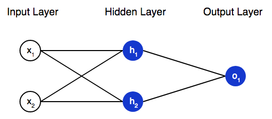

```
import numpy as np

# ... code from previous section here

class OurNeuralNetwork:
  '''
  A neural network with:
    - 2 inputs
    - a hidden layer with 2 neurons (h1, h2)
    - an output layer with 1 neuron (o1)
  Each neuron has the same weights and bias:
    - w = [0, 1]
    - b = 0
  '''
  def __init__(self):
    weights = np.array([0, 1])
    bias = 0

    # The Neuron class here is from the previous section
    self.h1 = Neuron(weights, bias)
    self.h2 = Neuron(weights, bias)
    self.o1 = Neuron(weights, bias)

  def feedforward(self, x):
    out_h1 = self.h1.feedforward(x)
    out_h2 = self.h2.feedforward(x)

    # The inputs for o1 are the outputs from h1 and h2
    out_o1 = self.o1.feedforward(np.array([out_h1, out_h2]))

    return out_o1

network = OurNeuralNetwork()
x = np.array([2, 3])
print(network.feedforward(x)) # 0.7216325609518421
We got 0.72160.7216 again! Looks like it works.
```

3. Training a Neural Network, Part 1
Say we have the following measurements:

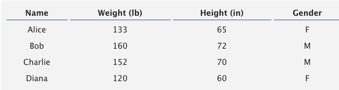

Let’s train our network to predict someone’s gender given their weight and height:

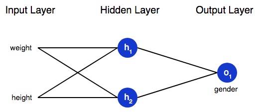

We’ll represent Male with a 0 and Female with a 1, and we’ll also shift the data to make it easier to use:

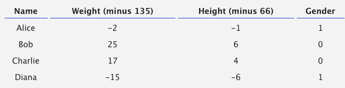

I arbitrarily chose the shift amounts (135 and 66) to make the numbers look nice. Normally, you’d shift by the mean.

### Loss
Before we train our network, we first need a way to quantify how “good” it’s doing so that it can try to do “better”. That’s what the loss is.

We’ll use the mean squared error (MSE) loss.

Better predictions = Lower loss.

Training a network = trying to minimize its loss.

### An Example Loss Calculation
Let’s say our network always outputs 0 - in other words, it’s confident all humans are Male 🤔. What would our loss be?

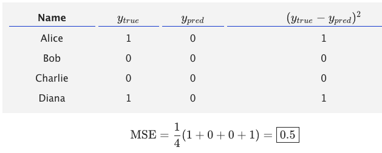
 
#### Code: MSE Loss
Here’s some code to calculate loss for us:

```
import numpy as np

def mse_loss(y_true, y_pred):
  # y_true and y_pred are numpy arrays of the same length.
  return ((y_true - y_pred) ** 2).mean()

y_true = np.array([1, 0, 0, 1])
y_pred = np.array([0, 0, 0, 0])

print(mse_loss(y_true, y_pred)) # 0.5
```

If you don't understand why this code works, read the NumPy quickstart on array operations.

4. Training a Neural Network, Part 2
We now have a clear goal: minimize the loss of the neural network. We know we can change the network’s weights and biases to influence its predictions, but how do we do so in a way that decreases loss?

> This section uses a bit of multivariable calculus. If you’re not comfortable with calculus, feel free to skip over the math parts.

For simplicity, let’s pretend we only have Alice in our dataset:

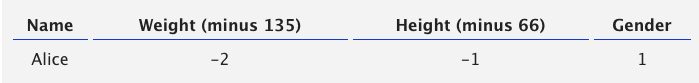

Then the mean squared error loss is just Alice’s squared error
 
Another way to think about loss is as a function of weights and biases. Let’s label each weight and bias in our network:

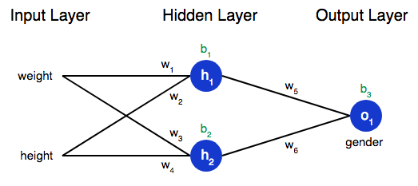

### Training: Stochastic Gradient Descent
We have all the tools we need to train a neural network now! We’ll use an optimization algorithm called stochastic gradient descent (SGD) that tells us how to change our weights and biases to minimize loss.

#### Code: A Complete Neural Network
It’s finally time to implement a complete neural network:

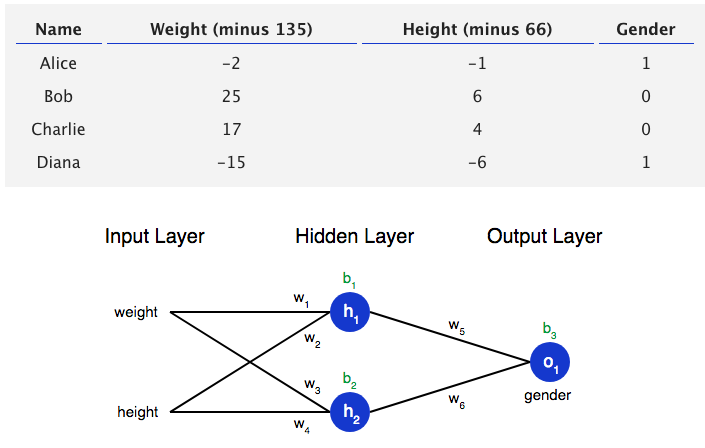

```
import numpy as np

def sigmoid(x):
  # Sigmoid activation function: f(x) = 1 / (1 + e^(-x))
  return 1 / (1 + np.exp(-x))

def deriv_sigmoid(x):
  # Derivative of sigmoid: f'(x) = f(x) * (1 - f(x))
  fx = sigmoid(x)
  return fx * (1 - fx)

def mse_loss(y_true, y_pred):
  # y_true and y_pred are numpy arrays of the same length.
  return ((y_true - y_pred) ** 2).mean()

class OurNeuralNetwork:
  '''
  A neural network with:
    - 2 inputs
    - a hidden layer with 2 neurons (h1, h2)
    - an output layer with 1 neuron (o1)

  *** DISCLAIMER ***:
  The code below is intended to be simple and educational, NOT optimal.
  Real neural net code looks nothing like this. DO NOT use this code.
  Instead, read/run it to understand how this specific network works.
  '''
  def __init__(self):
    # Weights
    self.w1 = np.random.normal()
    self.w2 = np.random.normal()
    self.w3 = np.random.normal()
    self.w4 = np.random.normal()
    self.w5 = np.random.normal()
    self.w6 = np.random.normal()

    # Biases
    self.b1 = np.random.normal()
    self.b2 = np.random.normal()
    self.b3 = np.random.normal()

  def feedforward(self, x):
    # x is a numpy array with 2 elements.
    h1 = sigmoid(self.w1 * x[0] + self.w2 * x[1] + self.b1)
    h2 = sigmoid(self.w3 * x[0] + self.w4 * x[1] + self.b2)
    o1 = sigmoid(self.w5 * h1 + self.w6 * h2 + self.b3)
    return o1

  def train(self, data, all_y_trues):
    '''
    - data is a (n x 2) numpy array, n = # of samples in the dataset.
    - all_y_trues is a numpy array with n elements.
      Elements in all_y_trues correspond to those in data.
    '''
    learn_rate = 0.1
    epochs = 1000 # number of times to loop through the entire dataset

    for epoch in range(epochs):
      for x, y_true in zip(data, all_y_trues):
        # --- Do a feedforward (we'll need these values later)
        sum_h1 = self.w1 * x[0] + self.w2 * x[1] + self.b1
        h1 = sigmoid(sum_h1)

        sum_h2 = self.w3 * x[0] + self.w4 * x[1] + self.b2
        h2 = sigmoid(sum_h2)

        sum_o1 = self.w5 * h1 + self.w6 * h2 + self.b3
        o1 = sigmoid(sum_o1)
        y_pred = o1

        # --- Calculate partial derivatives.
        # --- Naming: d_L_d_w1 represents "partial L / partial w1"
        d_L_d_ypred = -2 * (y_true - y_pred)

        # Neuron o1
        d_ypred_d_w5 = h1 * deriv_sigmoid(sum_o1)
        d_ypred_d_w6 = h2 * deriv_sigmoid(sum_o1)
        d_ypred_d_b3 = deriv_sigmoid(sum_o1)

        d_ypred_d_h1 = self.w5 * deriv_sigmoid(sum_o1)
        d_ypred_d_h2 = self.w6 * deriv_sigmoid(sum_o1)

        # Neuron h1
        d_h1_d_w1 = x[0] * deriv_sigmoid(sum_h1)
        d_h1_d_w2 = x[1] * deriv_sigmoid(sum_h1)
        d_h1_d_b1 = deriv_sigmoid(sum_h1)

        # Neuron h2
        d_h2_d_w3 = x[0] * deriv_sigmoid(sum_h2)
        d_h2_d_w4 = x[1] * deriv_sigmoid(sum_h2)
        d_h2_d_b2 = deriv_sigmoid(sum_h2)

        # --- Update weights and biases
        # Neuron h1
        self.w1 -= learn_rate * d_L_d_ypred * d_ypred_d_h1 * d_h1_d_w1
        self.w2 -= learn_rate * d_L_d_ypred * d_ypred_d_h1 * d_h1_d_w2
        self.b1 -= learn_rate * d_L_d_ypred * d_ypred_d_h1 * d_h1_d_b1

        # Neuron h2
        self.w3 -= learn_rate * d_L_d_ypred * d_ypred_d_h2 * d_h2_d_w3
        self.w4 -= learn_rate * d_L_d_ypred * d_ypred_d_h2 * d_h2_d_w4
        self.b2 -= learn_rate * d_L_d_ypred * d_ypred_d_h2 * d_h2_d_b2

        # Neuron o1
        self.w5 -= learn_rate * d_L_d_ypred * d_ypred_d_w5
        self.w6 -= learn_rate * d_L_d_ypred * d_ypred_d_w6
        self.b3 -= learn_rate * d_L_d_ypred * d_ypred_d_b3

      # --- Calculate total loss at the end of each epoch
      if epoch % 10 == 0:
        y_preds = np.apply_along_axis(self.feedforward, 1, data)
        loss = mse_loss(all_y_trues, y_preds)
        print("Epoch %d loss: %.3f" % (epoch, loss))

# Define dataset
data = np.array([
  [-2, -1],  # Alice
  [25, 6],   # Bob
  [17, 4],   # Charlie
  [-15, -6], # Diana
])
all_y_trues = np.array([
  1, # Alice
  0, # Bob
  0, # Charlie
  1, # Diana
])

# Train our neural network!
network = OurNeuralNetwork()
network.train(data, all_y_trues)
```

Our loss steadily decreases as the network learns:

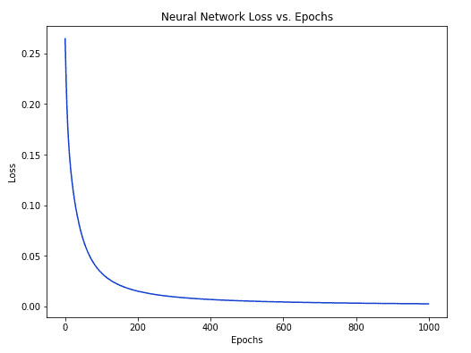

We can now use the network to predict genders:

```
# Make some predictions
emily = np.array([-7, -3]) # 128 pounds, 63 inches
frank = np.array([20, 2])  # 155 pounds, 68 inches
print("Emily: %.3f" % network.feedforward(emily)) # 0.951 - F
print("Frank: %.3f" % network.feedforward(frank)) # 0.039 - M
```

### Now What?
You made it! A quick recap of what we did:

* Introduced neurons, the building blocks of neural networks.
* Used the sigmoid activation function in our neurons.
* Saw that neural networks are just neurons connected together.
* Created a dataset with Weight and Height as inputs (or features) and Gender as the output (or label).
* Learned about loss functions and the mean squared error (MSE) loss.
* Realized that training a network is just minimizing its loss.
* Used backpropagation to calculate partial derivatives.
* Used stochastic gradient descent (SGD) to train our network.

There’s still much more to do:

* Experiment with bigger / better neural networks using proper machine learning libraries like Tensorflow, Keras, and PyTorch.
* Build your first neural network with Keras.
* Tinker with a neural network in your browser.
* Discover other activation functions besides sigmoid, like Softmax.
* Discover other optimizers besides SGD.
* Read my introduction to Convolutional Neural Networks (CNNs). CNNs revolutionized the field of Computer Vision and can be extremely powerful.
* Read my introduction to Recurrent Neural Networks (RNNs), which are often used for Natural Language Processing (NLP).
